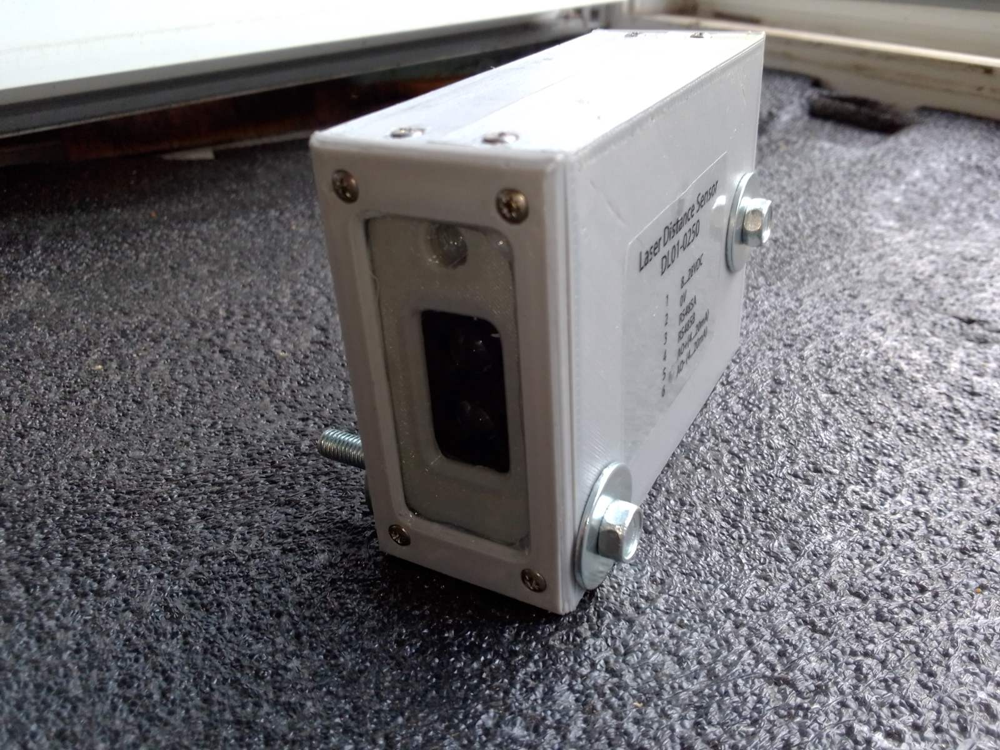

# Custom Industrial Laser Distance Sensor Based on TF-Luna

Custom industrial laser distance sensor developed as a cost-effective replacement for an obsolete industrial distance sensor.

## Features

- TF-Luna ToF laser module
- ATmega328PB microcontroller
- RS-485 Modbus RTU
- 4–20 mA analog output
- Digital signal filtering
- EEPROM-stored calibration
- Custom industrial enclosure

The sensor is currently operating on a concrete block production line for automatic concrete mixture dosing.

## Videos

### Automatic Dosing (Close View)
https://youtube.com/shorts/zwSHPJO99uA

### Automatic Dosing (Front View)
https://youtube.com/shorts/gGjYULFCIdY

### Operator HMI Display
Measurements from both laser sensors (K1 and K2)
https://youtu.be/ycKj416GfGs

## More Information

Hackaday Project:
https://hackaday.io/...

